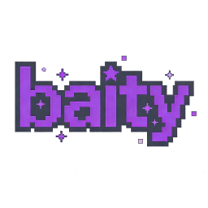

# Baity

A visual and utility mod currently in development mainly for Hypixel SkyBlock.

## License / 许可证

This project is licensed under the GNU Affero General Public License v3.0 (AGPL-3.0).
For full license text, please see the [LICENSE](LICENSE) file.

本项目采用 GNU Affero General Public License v3.0 (AGPL-3.0) 许可证。
完整条款请参阅 [LICENSE](LICENSE) 文件。

## Usage Disclaimer / 使用声明

This mod is provided **for personal learning and experimentation only**.  
The author does **not** guarantee that the mod is safe, permitted, or compliant on any specific server, and will **not** be responsible for any consequences (including but not limited to account penalties, data loss, or other damage) arising from the use of this mod.
By using this mod, you agree that you do so at your own risk.

Sync Protocol / 同步协议：see [docs/sync-protocol.md](docs/sync-protocol.md).

本模组仅用于**个人学习和研究**用途。  
作者**不保证**本模组在任何特定服务器环境下的安全性、合规性或被允许使用，也**不对**因使用本模组所产生的任何后果（包括但不限于账号处罚、数据丢失或其他损失）承担责任。  
使用本模组即代表您同意自行承担一切风险。

同步协议：见 [docs/sync-protocol.md](docs/sync-protocol.md)。

## Acknowledgements / 致谢

This project makes use of the excellent [owo-lib](https://github.com/wisp-forest/owo-lib) by Wisp Forest for modern UI tooling and rendering utilities.  
We would like to thank the owo-lib maintainers and contributors for their work.

本项目使用了 Wisp Forest 提供的优秀 UI 与渲染工具库 [owo-lib](https://github.com/wisp-forest/owo-lib)。  
在此对 owo-lib 的维护者和贡献者表示感谢。
